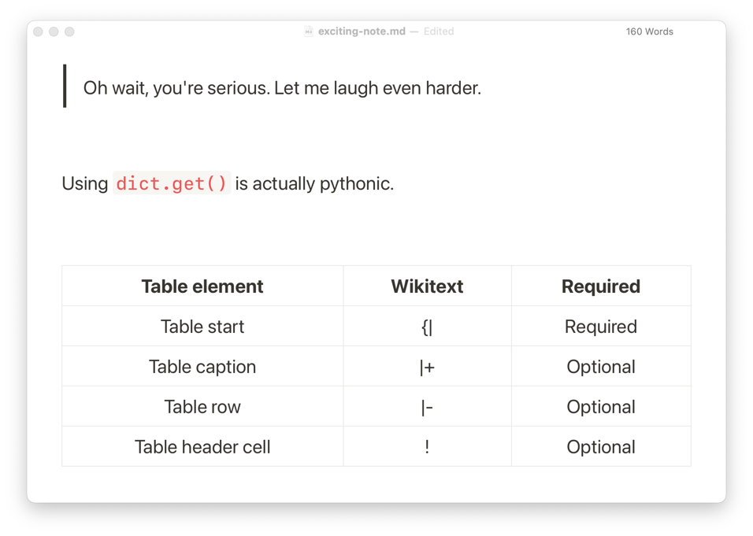
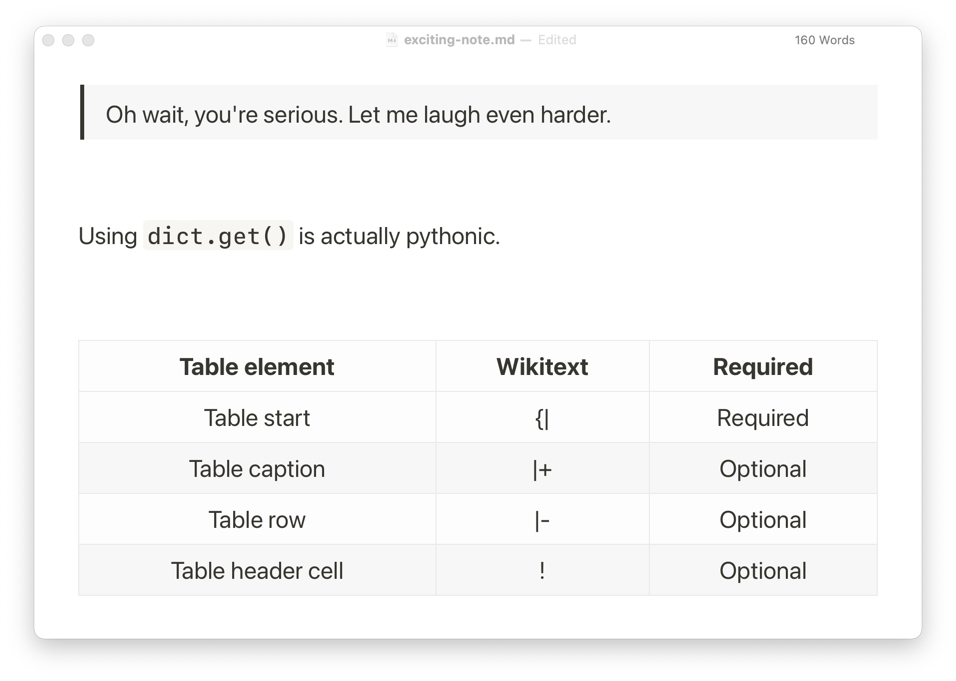
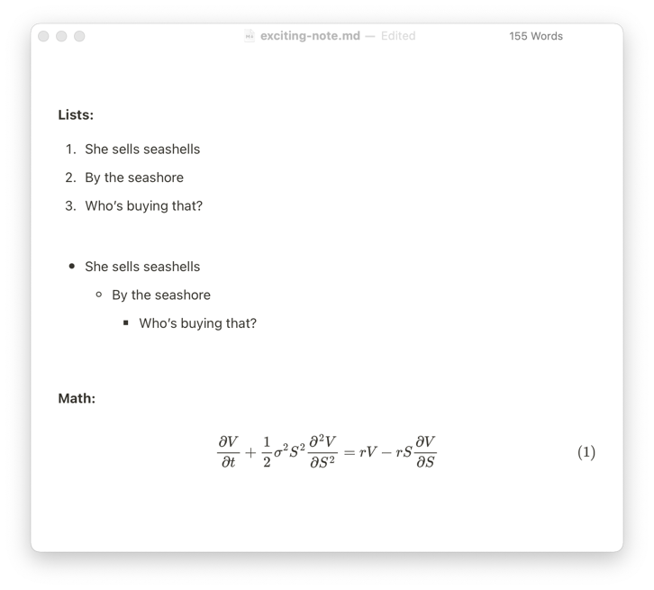
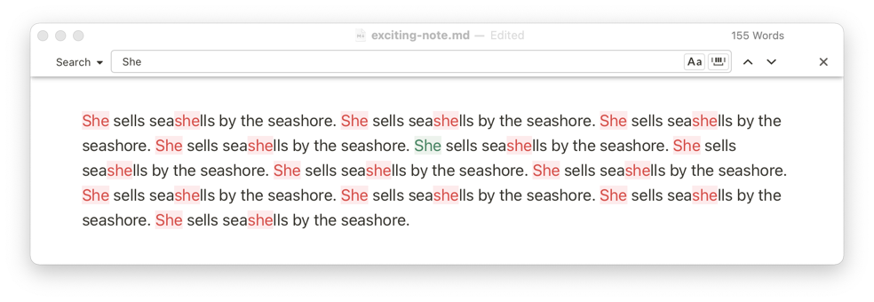
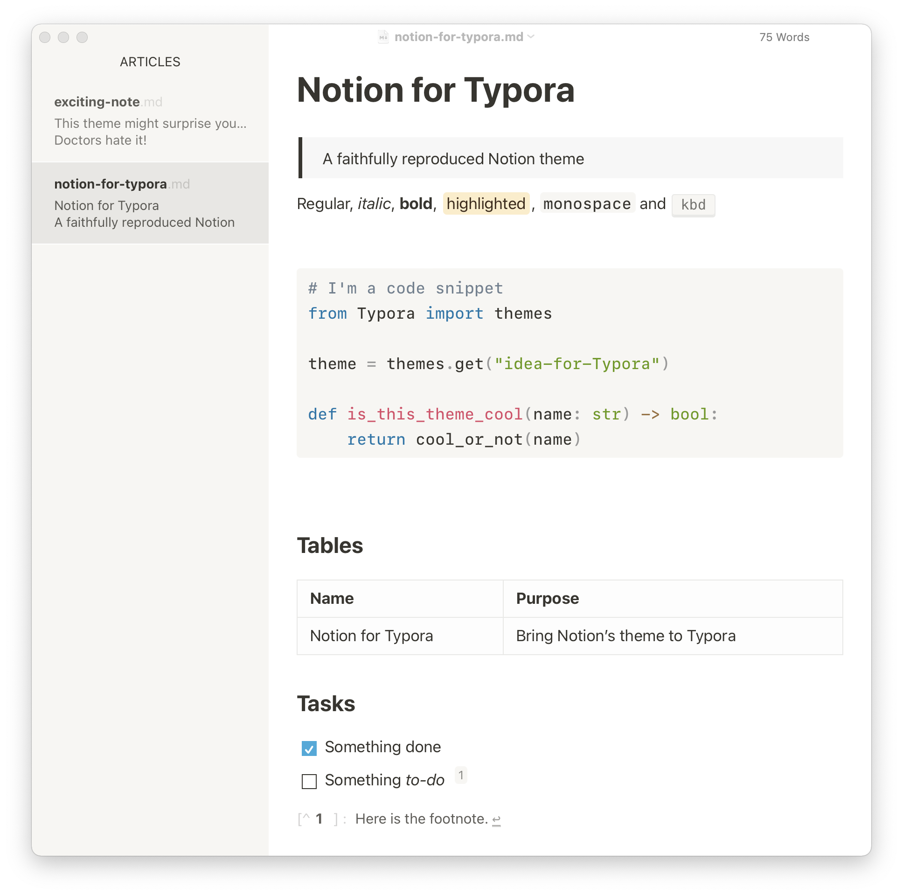
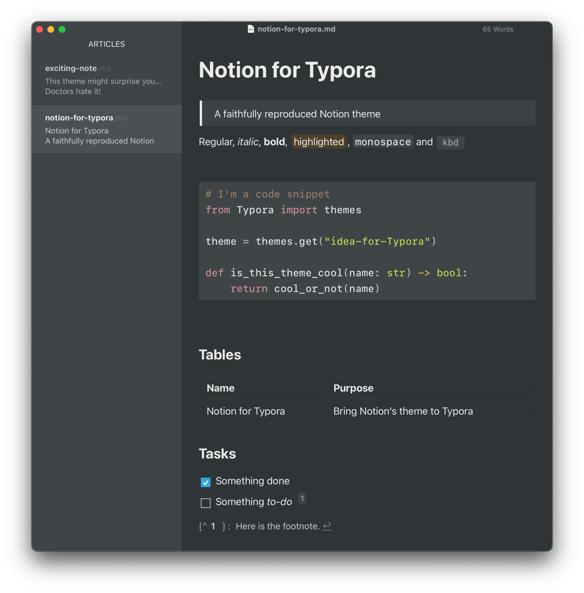

# Notion for Typora
A faithful reproduction of the original Notion theme, available in both dark mode and light mode.

## Styles

The theme is available in two styles: `original` and `enhanced`. The original style features simpler quotations and tables, mimicking the Notion app. The enhanced style darkens quotation backgrounds and adds alternating colors to the table backgrounds, improving visibility.

Original style             |  Enhanced Style
:-------------------------:|:-------------------------:
  |  

## Install

- Download the [zipped themes package](https://github.com/adrian-fuertes/typora-notion-theme/zipball/master/themes).
- Copy the chosen `.css` file and to your Typora theme library.
- Launch or restart Typora and choose the theme from the menu.

> Note: This theme has been created and tested in macOS 12, though it should work on Windows as well.
>
> Having `SF Mono` or `Fira Code` installed is highly recommended for appropriate code display.

## Screenshots

